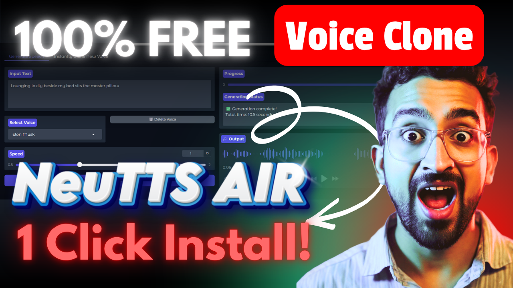

# NeuTTS-Air NVIDIA GPU Edition

Advanced Text-to-Speech Generation with Unlimited Capabilities

## 🎯 Key Features

### 🚀 Unlimited Generation
Generate unlimited high-quality audio with no restrictions. Process entire documents, novels, podcasts, or any length of text seamlessly without performance degradation.

### 🧩 Smart Chunking
Intelligent text chunking technology automatically splits long texts into optimal segments for processing. Smart chunking ensures:
- Consistent audio quality across chunks
- Natural pronunciation and intonation
- Smooth transitions between segments
- Efficient memory management
- Batch processing capabilities

### 🎤 Voice Cloning
Clone any voice from audio samples to create personalized speech synthesis. Supports multiple voice profiles for different contexts.

### 🔧 GPU Acceleration
Full NVIDIA GPU support with CUDA 12.6 optimization for blazing-fast inference speeds.

### 🎛️ Advanced Model
Built on cutting-edge NeuPhonic NeuTTS-Air model for state-of-the-art speech quality and naturalness.

## 📚 Tutorial

For a complete walkthrough and examples, check out the official tutorial:

[](https://youtu.be/VNb31bw1Itc)

This tutorial covers:
- Installation and setup
- Voice cloning process
- Generating unlimited audio
- Smart chunking configuration
- Performance optimization
- Advanced features and tips


## 📋 Requirements

All dependencies are listed in `requirements.txt` with:
- PyTorch 2.9.1 with CUDA support
- Transformers 4.56.1
- Librosa for audio processing
- Gradio 5.49.1 for web interface
- FastAPI for backend services
- And 100+ additional optimization libraries

## 🚀 Getting Started

### Installation

1. Clone the repository
```bash
git clone https://github.com/niteshsharmacodes/neutts-ultimate.git
cd neutts-air
```

2. Create virtual environment
```bash
python -m venv .venv
.venv\Scripts\activate
```

3. Install dependencies
```bash
pip install -r requirements.txt
```

4. Run the application
```bash
python app.py
```


## 📂 Project Structure

```
neutts-air/
├── app.py                 # Main application entry point
├── requirements.txt       # Python dependencies
├── Models/
│   └── neutts-air/        # Pre-trained model files
├── neuttsair/             # Core TTS module
│   ├── __init__.py
│   └── neutts.py
├── samples/               # Voice samples for cloning
│   ├── dave.pt
│   ├── Elon Musk.pt
│   ├── Joe Rogan.pt
│   └── ...
└── README.md              # This file
```

## 🎤 Voice Samples Included

The project includes pre-configured voice samples for quick testing:
- Dave (Generic voice)
- Elon Musk
- Joe Rogan
- Morgan Freeman
- Trump
- Jarvis (AI assistant style)
- Jo

## 🔧 System Requirements

- **GPU**: NVIDIA GPU with CUDA 12.6+ support
- **Memory**: Minimum 8GB VRAM (16GB recommended)
- **CPU**: Modern multi-core processor
- **Python**: 3.9+
- **OS**: Windows, Linux, macOS

## 💡 Usage Examples

### Basic Generation
```python
from neuttsair import NeuTTS

tts = NeuTTS()
audio = tts.generate("Hello world!", voice="dave.pt")
```

### Unlimited Text Processing
```python
# Smart chunking handles long texts automatically
long_text = "Your very long text here..."
audio = tts.generate(long_text, smart_chunking=True)
```

Do subscribe to my youtube channel for more such releases! - https://www.youtube.com/@TheOracleGuy_AI

## 🤝 Contributing

Contributions are welcome! Please feel free to submit issues and pull requests.

## 📄 License

This project is provided as-is for research and commercial use.

## 📞 Support

For issues, questions, or feature requests, please visit the repository or check the YouTube tutorial.

---

**Built with ❤️ by The Oracle Guy for advanced speech synthesis**
